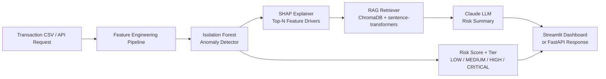

# Financial Risk Intelligence Platform


An end-to-end transaction risk scoring system that combines **unsupervised anomaly detection**, **SHAP explainability**, a **RAG pipeline over regulatory policy documents**, and **Claude-powered risk summaries** — served through a FastAPI endpoint and an interactive Streamlit dashboard.

Built as a portfolio project targeting data science and risk analytics roles in Australian financial services.

---

## What it does

A transaction is scored in four stages:

1. **Detect** — An Isolation Forest model (tuned with Optuna, tracked in MLflow) assigns a continuous risk score to each transaction
2. **Explain** — SHAP feature attributions identify the top drivers pushing the score up or down
3. **Retrieve** — A RAG pipeline queries ChromaDB for the most relevant AML, fraud, and sanctions policy chunks given those drivers
4. **Summarise** — Claude synthesises the score, SHAP context, and policy excerpts into a plain-English risk brief for the analyst

---

## Architecture



---

## Dashboard

The Streamlit dashboard has three tabs:

**Tab 1 — Upload & Scan**
Upload any transaction CSV (or use the built-in demo dataset). All transactions are scored instantly. A summary card shows total transactions, flagged count, and estimated fraud exposure in AUD. The flagged table is filterable by risk tier, with colour-coded rows.

**Tab 2 — Transaction Detail**
Click any flagged row to drill into a single transaction. Shows:
- SHAP bar chart of the top feature drivers
- AI risk brief generated by Claude (severity assessment, key risk factors, recommended action)
- Expandable policy context showing which AML/fraud/sanctions rules triggered

**Tab 3 — Model Insights**
Global model diagnostics across the current batch:
- Risk score histogram
- Risk tier breakdown (pie chart)
- Scatter plot of amount vs. risk score coloured by tier

---

## Tech Stack

| Layer | Tools |
|---|---|
| Anomaly detection | scikit-learn (Isolation Forest) |
| Explainability | SHAP |
| Experiment tracking | MLflow + Optuna |
| RAG pipeline | LangChain, ChromaDB, sentence-transformers (`all-MiniLM-L6-v2`) |
| LLM | Claude via Anthropic API |
| API | FastAPI + Pydantic v2 |
| Dashboard | Streamlit + Plotly |
| Config & secrets | python-dotenv |

---

## Quickstart

### 1. Clone and set up the environment

```bash
git clone https://github.com/Dyldubs/financial-risk-intelligence.git
cd financial-risk-intelligence

python -m venv .venv
source .venv/bin/activate      # Windows: .venv\Scripts\activate
pip install -r requirements.txt
```

### 2. Configure environment variables

```bash
cp .env.example .env
# Open .env and add your ANTHROPIC_API_KEY
```

Get a free API key at [console.anthropic.com](https://console.anthropic.com). The app works without one — it falls back to a rule-based summary — but the AI brief won't be generated.

### 3. Train the model

```bash
python scripts/train.py
```

Runs 30 Optuna trials, logs all runs to MLflow (`mlflow.db`), and saves the best model to `models/detector.joblib`. Takes about 2 minutes on CPU.

To use the real [Kaggle Credit Card Fraud dataset](https://www.kaggle.com/datasets/mlg-ulb/creditcardfraud) instead of synthetic data:

```bash
python scripts/train.py --data data/raw/creditcard.csv
```

### 4. Ingest policy documents

```bash
python scripts/ingest_policies.py
```

Chunks and embeds the four policy documents in `data/policies/` into ChromaDB using a local sentence-transformers model (no API key needed). Only needs to run once, or when policy documents change.

### 5. Launch the dashboard

```bash
streamlit run app/streamlit_app.py
```

### 6. (Optional) Launch the REST API

```bash
uvicorn src.api.main:app --reload --port 8000
```

Interactive API docs at [http://localhost:8000/docs](http://localhost:8000/docs)

---

## API Usage

```bash
curl -X POST http://localhost:8000/analyse \
  -H "Content-Type: application/json" \
  -d '{
    "transactions": [{
      "transaction_id": "TXN-001",
      "amount": 9800.00,
      "hour": 2,
      "velocity_1h": 4,
      "velocity_24h": 12,
      "high_risk_country": 1,
      "amount_vs_avg_ratio": 8.5,
      "merchant_risk_tier": 2,
      "days_since_account_open": 15,
      "is_weekend": 1
    }],
    "include_summaries": true
  }'
```

**Example response:**

```json
{
  "total": 1,
  "flagged": 1,
  "results": [{
    "transaction_id": "TXN-001",
    "amount": 9800.0,
    "risk_score": 0.87,
    "risk_tier": "CRITICAL",
    "top_drivers": "high_risk_country (+0.31), amount_vs_avg_ratio (+0.28), velocity_1h (+0.19)",
    "policy_context": "[AML Policy] Large cash transaction threshold exceeded...",
    "risk_summary": "CRITICAL risk. Transaction exhibits three concurrent high-risk indicators...",
    "recommended_action": "Immediately escalate to the Financial Crime team. Freeze transaction pending review."
  }]
}
```

---

## Project Structure

```
financial-risk-intelligence/
├── app/
│   └── streamlit_app.py          # Streamlit dashboard (3 tabs)
├── data/
│   ├── policies/                 # AML, fraud, sanctions, TM threshold docs
│   └── raw/                      # Place creditcard.csv here (gitignored)
├── models/                       # Saved model artifacts (auto-created)
│   ├── detector.joblib
│   └── feature_pipeline.joblib
├── scripts/
│   ├── train.py                  # Train and save the anomaly detector
│   └── ingest_policies.py        # Embed policy docs into ChromaDB
├── src/
│   ├── config.py                 # Central config loaded from .env
│   ├── data/
│   │   ├── loader.py             # CSV loader + synthetic data generator
│   │   └── features.py           # Feature engineering pipeline
│   ├── models/
│   │   ├── detector.py           # Isolation Forest + Optuna + MLflow
│   │   └── explainer.py          # SHAP TreeExplainer wrapper
│   ├── rag/
│   │   ├── ingestion.py          # Document chunking + ChromaDB ingestion
│   │   └── retriever.py          # Similarity retrieval + query builder
│   ├── llm/
│   │   └── summariser.py         # Claude risk brief generation
│   └── api/
│       └── main.py               # FastAPI app: /analyse, /health, /model/info
├── chroma_db/                    # ChromaDB vector store (auto-created)
├── .env.example                  # Template for environment variables
├── requirements.txt
└── README.md
```

---

## Key Features

**Unsupervised detection for imbalanced data**
Isolation Forest doesn't require labelled fraud examples, making it practical for real-world datasets where fraud labels are rare, noisy, or unavailable.

**Interpretable by design**
SHAP values provide per-transaction explanations that satisfy the explainability requirements of regulated financial environments (APRA, ASIC). Analysts can see exactly why a transaction was flagged.

**Grounded AI summaries via RAG**
Rather than relying on an LLM's general knowledge, risk summaries are grounded in actual policy documents (AML/CTF Act thresholds, OFAC/DFAT sanctions rules, internal fraud typologies). This reduces hallucination risk and keeps outputs auditable.

**Production-ready API**
The FastAPI endpoint accepts batches of transactions, validates inputs with Pydantic v2, and is ready to sit behind an API gateway. Auto-generated OpenAPI docs at `/docs`.

---

## Regulatory Policy Documents

The RAG pipeline is pre-loaded with four policy documents covering Australian financial crime compliance:

- `aml_policy.txt` — AML/CTF Act thresholds and escalation procedures
- `fraud_indicators.txt` — Velocity, account takeover, card-not-present, and first-party fraud typologies
- `sanctions_screening.txt` — OFAC, DFAT, and UNSC sanctions screening + PEP rules
- `transaction_monitoring_thresholds.txt` — TM rules TM-001 through TM-051

These can be replaced or extended with any `.txt` documents by re-running `scripts/ingest_policies.py`.

---

## Skills Demonstrated

| Skill | Where |
|---|---|
| Unsupervised anomaly detection | `src/models/detector.py` |
| Feature engineering with sklearn Pipelines | `src/data/features.py` |
| Hyperparameter optimisation (Optuna) | `src/models/detector.py` |
| Experiment tracking (MLflow) | `src/models/detector.py` |
| SHAP explainability | `src/models/explainer.py` |
| RAG pipeline design | `src/rag/` |
| Vector embeddings + similarity search | `src/rag/ingestion.py`, `retriever.py` |
| LLM integration with structured prompting | `src/llm/summariser.py` |
| REST API design (FastAPI + Pydantic v2) | `src/api/main.py` |
| Interactive data dashboard (Streamlit + Plotly) | `app/streamlit_app.py` |

---

## Deployment

The app is deployed on Streamlit Community Cloud. To deploy your own fork:

1. Push to a public GitHub repo
2. Go to [share.streamlit.io](https://share.streamlit.io) and connect the repo
3. Set `ANTHROPIC_API_KEY` under Settings → Secrets
4. Point the app at `app/streamlit_app.py`
